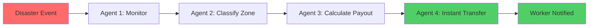
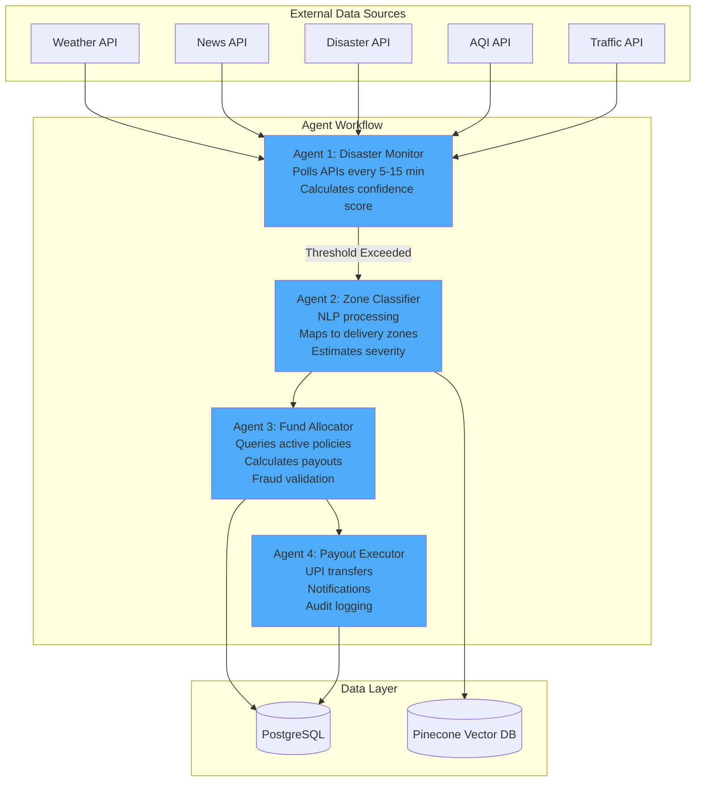
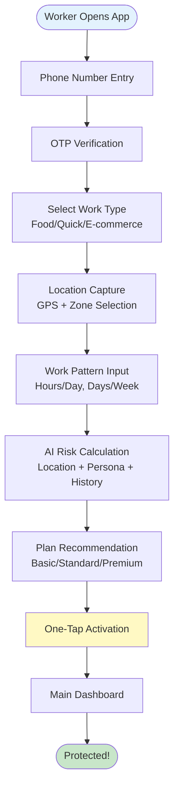

# Gigsurance - Realtime AI Driven Parametric Insurance Platform for India's Gig Economy

<p align="center">
  
</p>

---

# Breaking down Gigsurance in Four Steps

**1. Who is our user really?**  
**2. How does our AI actually work**  
**3. How does it get built?**  
**4. Gigsurance - Our Final Delivery**  

# 1️⃣ Who is our user really? - Tip of the ICE

<p align="center">
  
</p>

# ⚠️ The Actual Problem

**One line Statement - No financial safety net for loss of working time for India's Gig Workers**

**So, What type of Gig Workers are you targeting?**

# 🧑 Revealing our Target User Persona

**1. Our Focused Persona - Metro Cities based Gig Delivery Workers**  
**2. Total no of active Gig Workers in Metro Cities - 25 Lakhs**  
**3. Source link** : [https://www.outlookbusiness.com/news/pay-education-demographics-what-the-numbers-say-about-indias-1-crore-gig-workers]

# Our Focused Metro Cities for Gig Workers

| City        | Estimated Gig Workers | Key Risk Factors              |
|------------|---------------------|------------------------------|
| Bangalore   | 4–6 lakh+           | Rain, traffic, high demand   |
| Delhi NCR   | 5–7 lakh+           | Pollution, traffic, curfews  |
| Mumbai      | 3–5 lakh+           | Heavy rain, congestion       |
| Chennai     | 3–4 lakh+           | Flooding, cyclones           |
| Hyderabad   | 2–3 lakh+           | Supply disruptions           |
| Pune        | 1.5–2.5 lakh+       | Traffic, demand spikes       |
| Kolkata     | 1–2 lakh+           | Weather + infra disruptions  |

# Our Focused Working Models

| S.no | Type of Model | Platforms | Working Time | Peak hours |
|--------|-------------|----------|---------|---------|
| 1. | Food Delivery | Zomato, Swiggy | 10-12 hrs/day | Lunch + Dinner Time |
| 2. | Quick Commerce | Zepto, Blinkit, Swiggy Instamart | 9-10 hrs/day | Continuous & Seasoned Demands |
| 3. | E-Commerce | Amazon, Flipkart | 8-10 hrs/day | Scheduled Activities |

# Disruptions Covering under Gigsurance


<div align="center">

**Phase 1 MVP: 60-Second Onboarding + Autonomous Payout System**

*Building the future of gig worker protection, one agent at a time*

</div>

---

## The Problem

India's 15+ million gig workers face a critical vulnerability: when extreme weather, natural disasters, or environmental disruptions strike, their income stops instantly. Traditional insurance fails them completely.

### Traditional Insurance Model

```
Incident Occurs → User Files Claim → Documents Verified → Survey Done → Payment After Weeks
```

**Pain Points:**
- Weeks-long claim processing
- Complex document verification
- Manual survey requirements
- No coverage for external disruptions
- Designed for salaried workers, not gig economy

### The Gig Worker Reality

When heavy rainfall floods Chennai, delivery zones shut down. When cyclones hit, workers can't operate. When pollution levels spike, health risks prevent work. **Zero income. Zero protection.**

---

## Our Solution

**Gigsurance** transforms insurance through **parametric automation** - when a qualifying event occurs, payouts trigger automatically. No claims. No paperwork. Just instant protection.

**The Innovation:** Four autonomous AI agents work 24/7 to detect disruptions, validate events, calculate fair payouts, and execute instant transfers - all without human intervention.

### How It Works



**Example:** Rainfall > 120mm in Chennai → Automatic ₹500 payout to all affected workers within minutes.

---

## Key Innovations

### Autonomous Agent System

**Four AI agents work continuously to detect, validate, and execute payouts:**

- **Agent 1: Disaster Monitor** - Continuously polls weather, news, disaster APIs
- **Agent 2: Zone Classifier** - Maps disruptions to specific delivery zones using NLP
- **Agent 3: Fund Allocator** - Calculates individual payouts based on income baseline
- **Agent 4: Payout Executor** - Instantly transfers funds via UPI

### Real-Time Fraud Detection

**Multi-layered security system:**

- GPS spoofing detection through movement pattern analysis
- Behavioral verification (active hours, delivery routes, speed consistency)
- Multi-device triangulation prevention
- Trust score system (0-100) updated in real-time

### Dynamic Pricing Model

**Premium adjusts based on:**

- **Location Risk Score** - Historical disruption frequency in zone
- **Persona Type** - Food delivery vs Quick commerce vs E-commerce
- **Work Pattern** - Hours per day, days per week
- **Real-Time Conditions** - Current weather trends, seasonal patterns

### Predictive Intelligence

AI analyzes historical data to suggest optimal premium plans before disruptions occur, helping workers make informed decisions.

---

## Phase 1 Deliverables

> **Primary Focus: Core Platform + 60-Second Onboarding + Autonomous Payout System**

**What We're Building in Phase 1:**

The foundation of Gigsurance - a fully functional parametric insurance platform that demonstrates the core value proposition: instant, automated protection for gig workers.

### Mobile Application (Flutter)

**Gig Worker Onboarding in 60 Seconds**

The fastest insurance activation in the market:

- Phone verification with OTP
- Persona selection (Food Delivery / Quick Commerce / E-commerce)
- Location capture (GPS + manual zone selection)
- Work pattern input (hours/day, days/week)
- AI-powered plan recommendation (Basic / Standard / Premium)
- One-tap insurance activation

**Main Dashboard Features:**
- Live insurance status and coverage details
- Real-time location tracking
- Trust score display
- Payment history
- Weekly renewal management
- AI chatbot for support

### Admin Dashboard (Next.js)

**Event Monitoring & Management**

Complete control center for disruption management:

- Real-time disruption event feed
- Zone visualization with affected workers
- Manual event triggering capabilities
- Payout approval queue
- Worker management and verification
- Analytics and reporting

### Backend System (FastAPI)

**Core Infrastructure:**
- RESTful API for mobile and admin dashboards
- Agent orchestration system
- Risk calculation engine
- Dynamic pricing algorithm
- Fraud detection pipeline
- Payment integration (Razorpay)

---

## Technology Stack

| Layer | Technology |
|-------|-----------|
| **Mobile** | Flutter (Dart) |
| **Admin Dashboard** | Next.js 14 (TypeScript) |
| **Backend** | FastAPI (Python) |
| **AI/ML** | LangChain + OpenAI |
| **Database** | PostgreSQL + Pinecone (Vector DB) |
| **APIs** | Weather, News, Disaster, AQI, Traffic |
| **Payments** | Razorpay (UPI) |
| **Notifications** | SMS/WhatsApp API |

---

## Agent System Architecture



---

## Use Cases

### Scenario 1: Heavy Rainfall
**Event:** Rainfall exceeds 120mm in Chennai  
**Trigger:** Agent 1 detects threshold breach  
**Action:** Agent 2 maps affected zones → Agent 3 calculates payouts → Agent 4 transfers ₹500 to each worker  
**Time:** Complete in under 10 minutes

### Scenario 2: Delivery Zone Shutdown
**Event:** Local strike or curfew closes delivery zones  
**Trigger:** News API + Traffic API detect disruption  
**Action:** Automatic payout based on estimated income loss percentage  
**Time:** Instant after validation buffer

### Scenario 3: Cyclone Warning
**Event:** Wind speed > 80km/h detected  
**Trigger:** Weather API + Disaster API confirmation  
**Action:** Proactive alert sent to workers + automatic coverage activation  
**Time:** Pre-emptive protection before impact

---

## Competitive Advantages

| Traditional Insurance | Gigsurance |
|----------------------|------------|
| Weeks-long processing | **Instant payouts** |
| Manual claims filing | **Fully automated** |
| Document verification | **GPS-based validation** |
| Designed for salaried | **Built for gig workers** |
| Fixed pricing | **Dynamic, location-based** |
| Reactive coverage | **Predictive alerts** |

---

## Phase 1 Roadmap

**8-Week Sprint to MVP Launch**

### Weeks 1-2: Foundation
**Goal:** Core backend infrastructure and first agent

- Backend core infrastructure (FastAPI)
- PostgreSQL schema design
- Agent 1 implementation (Disaster Monitor)
- External API integrations (Weather, News, Disaster, AQI)

**Deliverable:** Working disaster detection system

### Weeks 3-4: User Interfaces
**Goal:** Complete user-facing applications

- Flutter mobile app (onboarding flow)
- Next.js admin dashboard (event monitoring)
- Authentication and authorization
- Location tracking service

**Deliverable:** Functional mobile app and admin dashboard

### Weeks 5-6: Intelligence Layer
**Goal:** Full agent workflow and fraud prevention

- Agent 2-4 implementation
- Fraud detection algorithms
- Risk calculation engine
- Dynamic pricing model

**Deliverable:** Complete autonomous payout system

### Weeks 7-8: Integration & Testing
**Goal:** Production-ready platform

- Payment gateway integration (Razorpay)
- Notification system (SMS/WhatsApp)
- End-to-end testing
- Performance optimization

**Deliverable:** Launch-ready MVP

---

## Future Phases

### Phase 2: Scale & Intelligence
- Multi-city expansion (Bangalore, Mumbai, Delhi)
- Advanced analytics dashboard
- Machine learning model refinement
- Platform partnerships (Swiggy, Zomato API integration)

### Phase 3: Ecosystem Integration
- Direct integration with gig platforms
- Real-time trip verification
- Revenue-based coverage models
- Community features

### Phase 4: Market Expansion
- Additional disruption types
- B2B partnerships
- Insurance product diversification
- International expansion

---

*Note: Future phases will be detailed after Phase 1 completion and user feedback integration.*

---

## Coverage Types

### Covered Events
- Extreme weather (heavy rain, cyclones, storms)
- Flooding (delivery zone shutdowns)
- Severe pollution (AQI thresholds)
- Curfews and lockdowns
- Local area strikes
- Market crashes
- Platform/server outages

### Not Covered
- Health or life issues
- Accidents
- Vehicle repairs
- Holidays
- Driver out of service (without disruption)
- Location outside registered zone

---

## Innovation Highlights

### Parametric Automation
Unlike traditional insurance, payouts are triggered by **objective data** (rainfall mm, wind speed km/h) rather than subjective claims. This eliminates fraud, speeds up processing, and ensures fairness.

### Zone-Level Precision
We don't just detect city-wide events - our AI maps disruptions to **specific delivery zones**, ensuring only affected workers receive payouts.

### Rolling Weekly Cycles
Each worker has an individualized 7-day cycle starting from their signup time, not a fixed Monday-Sunday schedule. This accommodates part-time workers and flexible schedules.

### Cooldown Period
New users have a 6-hour cooldown before coverage activates, preventing exploitation during active disruptions.

### Location Intelligence
System automatically detects if a worker has been in a different city for 24+ hours and prompts location update, ensuring accurate coverage and pricing.

---

## Visual Architecture

### System Overview


*Complete system architecture showing data flow from external APIs through agent workflow to payout execution*

### User Journey


*60-second onboarding journey from phone verification to insurance activation*

### Admin Interface


*Real-time event monitoring, worker management, and payout analytics*

### Agent Workflow Visualization


*Four-agent autonomous system processing disruptions from detection to payout*

### Onboarding Flow Diagram



---

## Getting Started

### For Gig Workers
1. Download the Gigsurance mobile app
2. Complete 60-second onboarding
3. Select your work type and location
4. Choose your insurance plan
5. Start earning with protection

### For Administrators
1. Access the admin dashboard
2. Monitor real-time events
3. Review payout approvals
4. Manage workers and policies
5. Analyze system performance

---

## Impact Vision

**Protecting India's Gig Economy**

- 15+ million potential beneficiaries
- Instant financial security during disruptions
- Fair, transparent pricing
- Zero paperwork, zero hassle
- Building resilience for the future of work

---

## Contact & Support

For inquiries, partnerships, or support:
- **Email:** support@gigsurance.in
- **Website:** [Coming Soon]
- **Documentation:** [Technical Docs]

---

## License

[License Type] - [Year] Gigsurance

---

**Built for India's Gig Workers**
